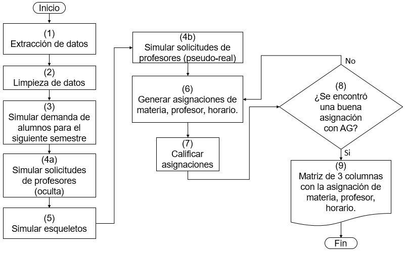

# Faculty_schedule_simulation
 In this repository we will simulate the schedule of Faculty of Sciences of UNAM

We will follow the next pipeline:

<!---
your comment goes here

# Simulation
-->
**(1) Data extraction**

1. We use the _posibles_url_ function, to generate all the possible URL's of the Faculty of Sciences, UNAM.

2. With the _Actualiza_list_url_ function, we erase the URL's of the web pages with no information.

3. With the _gen_m_grande_SIN_MOD_ function, we download the web pages information. To extract the information of one web page we use the _extrae_info_1_pag_ function.

**(2) Data cleaning**

The _gen_m_grande_ function, generates a matrix with the data of the web pages and cleans it. A matrix for each semester.

The _gen_m_grande_total_ function, creates a matrix with the data of several semesters. It concatenates the matrices of the _gen_m_grande_ function.

<!---
1. The _gen_m_grande_ function, cleans the data and generates a matrix with 37 columns (Subject, Teacher, Hour, hour_num, Places, Students, Classroom, Group, Bac_Degree, Syllabus, Semester, Changes, Shift, Subject_Sem, URL, Act2000, Act2006, Act2015, CdC1994, CdC2013, Mat1983, MAp2017, NomMat_Act2000, NomMat_Act2006, NomMat_Act2015, NomMat_CdC1994, NomMat_CdC2013, NomMat_Mat1983, NomMat_MAp2017, URL_Act2000, URL_Act2006, URL_Act2015, URL_CdC1994, URL_CdC2013, URL_Mat1983, URL_MAp2017, Num_materia)
-->

**(3) Students simulation**

1. We make a new matrix with the number of students per hour for each semester. Using the _gen_mat_alumnos_corregidos_ function.

2. We simulate the

3.

**(4) Teachers' requests simulation**

**(5) Skeletons' simulation**

1. Grading skeletons

**(6) Teachers' assignment**

**(7) Grading teachers' assignment**

**(8) Genetic Algorithm applied to search of assignments**

**(9) Final results**
